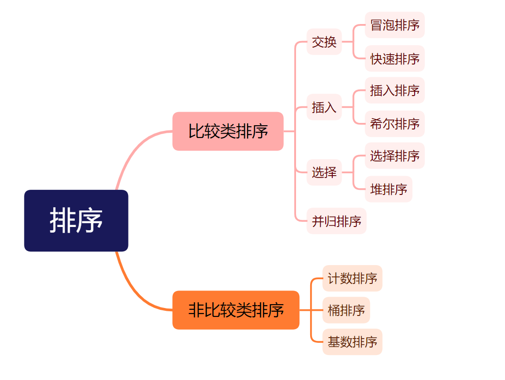
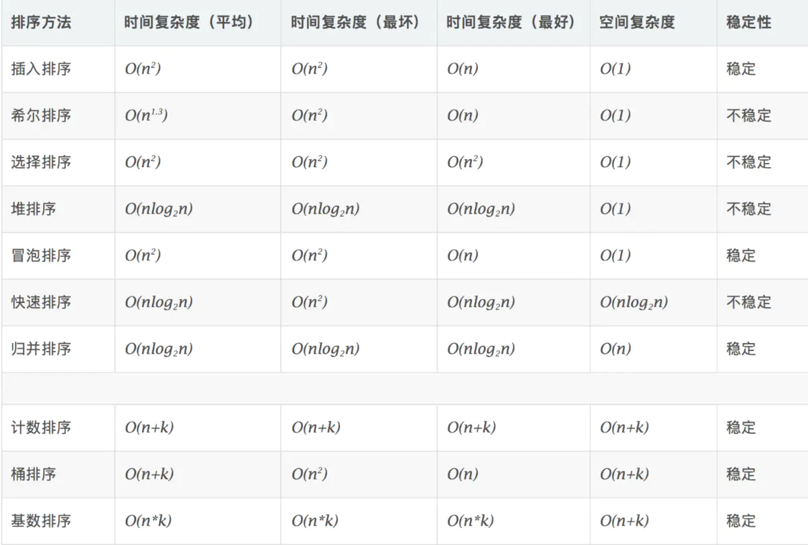
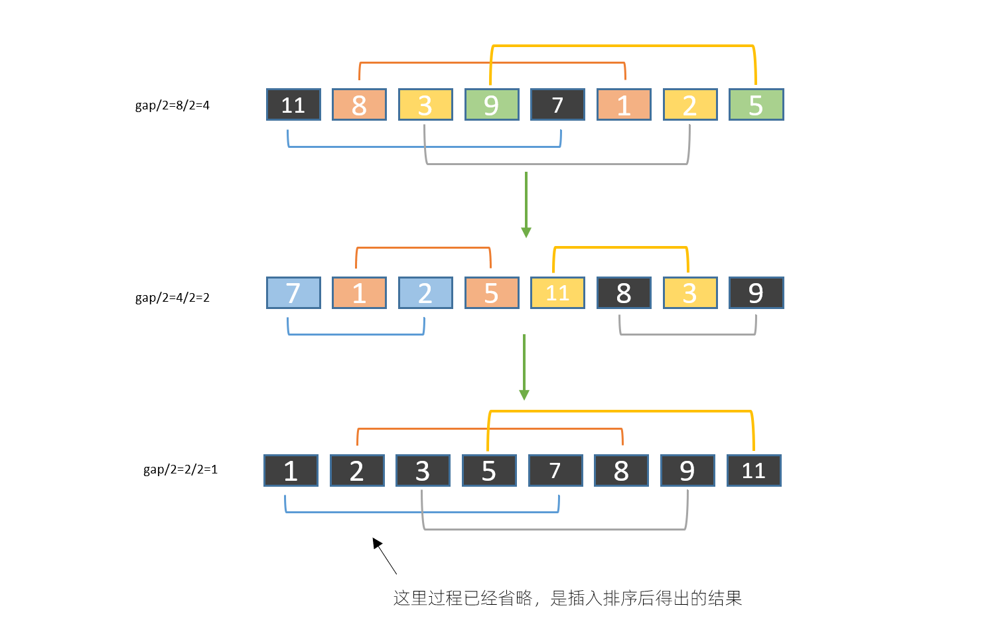

# 排序算法分类







# 冒泡排序

冒泡排序（Bubble Sort）算法的原理如下：

1. 比较相邻的元素。如果第一个比第二个大，就交换他们两个。

2. 对每一对相邻元素做同样的工作，从开始第一对到结尾的最后一对。在这一点，最后的元素应该会是最大的数。

3. 针对所有的元素重复以上的步骤，除了最后一个。

4. 持续每次对越来越少的元素重复上面的步骤，直到没有任何一对数字需要比较。
   
   

冒泡排序就是把小的元素往前调或者把大的元素往后调。比较是相邻的两个元素比较，交换也发生在这两个元素之间。所以，如果两个元素相等，是不会再交换的；如果两个相等的元素没有相邻，那么即使通过前面的两两交换把两个相邻起来，这时候也不会交换，所以相同元素的前后顺序并没有改变，所以冒泡排序是一种稳定排序算法。


冒泡排序适合小数据的排序，数据量大的时候不适合使用。


代码示例

```java
public void bubbleSort(int[] array) {
    int temp;
    for (int i = 0; i < array.length - 1; i++) {
        for (int j = 0; j < array.length - 1 - i; j++) {
            if (array[j] > array[j + 1]) {
                temp = array[j + 1];
                array[j + 1] = array[j];
                array[j] = temp;
            }
        }
    }
}
```


**优化：**

当某一轮比较结束并没有交换元素的位置，说明元素已经有序，不再进行比较

```java
public void bubbleSort(int[] array) {
    int temp;
    boolean flag; // 是否交换过位置
    for (int i = 0; i < array.length - 1; i++) {
        flag = false;
        for (int j = 0; j < array.length - 1 - i; j++) {
            if (array[j] > array[j + 1]) {
                temp = array[j + 1];
                array[j + 1] = array[j];
                array[j] = temp;
                flag = true;
            }
        }
        if (!flag) {
            break;
        }
    }
}
```


# 选择排序

选择排序（Selection sort）是一种简单直观的排序算法。它的工作原理是：第一次从待排序的数据元素中选出最小（或最大）的一个元素，存放在序列的起始位置，然后再从剩余的未排序元素中寻找到最小（大）元素，然后放到已排序的序列的末尾。以此类推，直到全部待排序的数据元素的个数为零。选择排序是不稳定的排序方法。


代码示例

```java
public void selectionSortt(int[] array) {
    int temp;
    for (int i = 0; i < array.length - 1; i++) {
        int min = i;
        for (int j = i + 1; j < array.length; j++) {
            if (array[j] < array[min]) {
                min = j;
            }
        }
        if (min == i) {
            continue;
        }
        temp = array[i];
        array[i] = array[min];
        array[min] = temp;
    }
}
```


# 插入排序

插入排序，一般也被称为直接插入排序。对于少量元素的排序，它是一个有效的算法 。插入排序是一种最简单的排序方法，它的基本思想是将一个记录插入到已经排好序的有序表中，从而一个新的、记录数增1的有序表。


代码示例

```java
public void insertionSort(int[] array) {
    int j, temp;
    for (int i = 1; i < array.length; i++) {
        temp = array[i];
        for (j = i - 1; j >= 0 && array[j] > temp; j--) {
            array[j + 1] = array[j];
        }
        array[j + 1] = temp;
    }
}
```


# 希尔排序

希尔排序(Shell's Sort)是插入排序的一种又称“缩小增量排序”（Diminishing Increment Sort），是直接插入排序算法的一种更高效的改进版本。希尔排序是非稳定排序算法。该方法因 D.L.Shell 于 1959 年提出而得名。


希尔排序是把记录按下标的一定增量分组，对每组使用直接插入排序算法排序；随着增量逐渐减少，每组包含的关键词越来越多，当增量减至 1 时，整个文件恰被分成一组，算法便终止。





代码示例

```java
public void shellSort(int[] array) {
    int j, temp;
    for (int group = array.length / 2; group > 0; group /= 2) {
        for (int i = group; i < array.length; i++) {
            temp = array[i];
            for (j = i - group; j >= 0 && array[j] > temp; j -= group) {
                array[j + group] = array[j];
            }
            array[j + group] = temp;
        }
    }
}
```


# 快速排序

快速排序算法通过多次比较和交换来实现排序，其排序流程如下：

1. 首先设定一个分界值，通过该分界值将数组分成左右两部分。

2. 将大于或等于分界值的数据集中到数组右边，小于分界值的数据集中到数组的左边。此时，左边部分中各元素都小于分界值，而右边部分中各元素都大于或等于分界值。

3. 然后，左边和右边的数据可以独立排序。对于左侧的数组数据，又可以取一个分界值，将该部分数据分成左右两部分，同样在左边放置较小值，右边放置较大值。右侧的数组数据也可以做类似处理。

4. 重复上述过程，可以看出，这是一个递归定义。通过递归将左侧部分排好序后，再递归排好右侧部分的顺序。当左、右两个部分各数据排序完成后，整个数组的排序也就完成了
   
   


代码示例

```java
public void quickSort(int[] array, int low, int high) {
    if (low > high) {
        return;
    }
    int left = low;
    int right = high;
    int pivot = array[low];
    while (low < high) {
        while (low < high && array[high] >= pivot) {
            high--;
        }
        if (array[high] < pivot) {
            array[low] = array[high];
            low++;
        }
        if (low == high) {
            array[low] = pivot;
            break;
        }

        while (low < high && array[low] < pivot) {
            low++;
        }
        if (pivot < array[low]) {
            array[high] = array[low];
            high--;
        }
        if (low == high) {
            array[low] = pivot;
        }
    }
    if (high > left) {
        quickSort(array, left, high - 1);
    }
    if (low < right) {
        quickSort(array, low + 1, right);
    }
}
```


